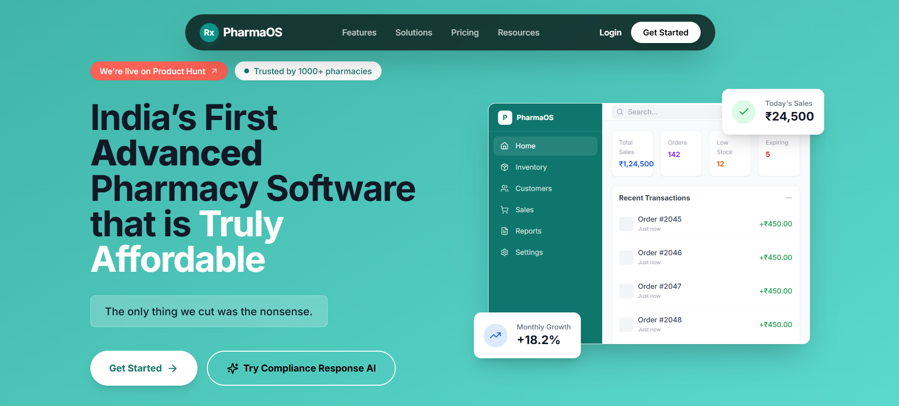

# PharmaOS - Intelligent Pharmacy Operations Platform

A comprehensive, AI-powered pharmacy management system built with Next.js, TypeScript, Express, and FastAPI. PharmaOS combines modern pharmacy operations with intelligent automation, predictive analytics, and an AI-powered Compliance Response system.

🔗 **Live Demo:** [https://pharmaos.vercel.app](https://pharmaos.vercel.app)

📚 **Documentation:** [Architecture](./ARCHITECTURE.md) | [API Docs](./API_DOCUMENTATION.md) | [Features](./FEATURES.md) | [Deployment](./DEPLOYMENT.md) | [Security](./SECURITY.md)



---

## 🏥 What is PharmaOS?

**PharmaOS** is an enterprise-grade pharmacy operations platform designed to streamline every aspect of pharmacy management—from inventory control and prescription processing to compliance documentation and vendor assessments.

### Core Capabilities:
- **Intelligent Inventory Management** — Real-time stock tracking, automated reorder alerts, expiry monitoring
- **Point of Sale (POS)** — Fast, intuitive billing with support for OPD, IPD, and OT workflows
- **Prescription Processing** — Digital prescription management with pharmacist verification workflows
- **Predictive Analytics** — ML-powered demand forecasting, inventory optimization, and expiry prediction
- **Role-Based Access Control** — Granular permissions for Admin, Manager, and Pharmacist roles
- **Audit & Compliance Logging** — Complete audit trails for regulatory compliance

---

## 🤖 Compliance Response AI

### What We're Building Now

The **Compliance Response AI** is an intelligent questionnaire assistant that leverages Retrieval-Augmented Generation (RAG) to automatically answer vendor assessment questionnaires, compliance audits, and security reviews.

### How It Works:

```
┌─────────────────┐     ┌──────────────────┐     ┌─────────────────┐
│   Vendor        │     │   RAG Pipeline   │     │   Generated     │
│   Questionnaire │ ──▶ │   + Knowledge    │ ──▶ │   Response      │
│                 │     │   Base           │     │   Document      │
└─────────────────┘     └──────────────────┘     └─────────────────┘
```

### Knowledge Base Coverage:

| Document | Topics Covered |
|----------|----------------|
| Platform Overview | System capabilities, user roles, core features |
| System Architecture | Infrastructure, tech stack, deployment |
| Security Policy | Encryption, authentication, access control |
| Privacy Policy | HIPAA compliance, data handling, consent |
| Compliance & Audit | Logging, retention, regulatory requirements |
| Disaster Recovery | RTO/RPO, backup procedures, failover |
| External Integrations | APIs, third-party systems, connectivity |
| Analytics & Reporting | BI capabilities, dashboards, exports |

---

---

## Table of Contents

1. [What We Built](#1-what-we-built)
2. [System Architecture](#2-system-architecture)
3. [Core Features](#3-core-features)
4. [USP Features](#4-usp-features)
5. [Technical Implementation](#5-technical-implementation)
6. [Assumptions We Made](#6-assumptions-we-made)
7. [Trade-offs We Made](#7-trade-offs-we-made)
8. [What We Would Improve](#8-what-we-would-improve)
9. [Deployment](#9-deployment)

---

## 1. What We Built

Compliance Response AI is a production-ready system that solves a real enterprise problem: **automating the repetitive process of answering vendor and compliance questionnaires**.

Organizations regularly receive structured questionnaires including:
- Vendor security assessments
- Compliance audit reviews
- Operational assessments
- Privacy and data handling evaluations
- Risk assessments

These questionnaires must be answered using verified internal documentation, which traditionally requires compliance teams to manually search through policies, copy relevant sections, and format responses. This process is time-consuming, error-prone, and repetitive.

**Our system automates this entire workflow:**

1. User uploads a questionnaire (XLSX format) along with reference documents (PDF, DOCX, TXT, MD)
2. System parses the questionnaire into individual questions
3. For each question, the RAG pipeline retrieves relevant information from uploaded documents
4. AI generates grounded answers with citations and evidence snippets
5. User reviews, edits, and approves responses
6. System exports the completed questionnaire in the original format


---

## 2. System Architecture

```
┌─────────────────────────────────────────────────────────────────────────┐
│                           FRONTEND (Next.js)                            │
│  ┌──────────────┐  ┌──────────────┐  ┌──────────────┐  ┌─────────────┐ │
│  │   Auth UI    │  │  AI Chat UI  │  │ Question     │  │   Export    │ │
│  │   (Firebase) │  │  (Cards)     │  │ Review Panel │  │   Manager   │ │
│  └──────────────┘  └──────────────┘  └──────────────┘  └─────────────┘ │
└─────────────────────────────────────────────────────────────────────────┘
                                    │
                                    ▼
┌─────────────────────────────────────────────────────────────────────────┐
│                         BACKEND API (Express)                           │
│  ┌──────────────┐  ┌──────────────┐  ┌──────────────┐  ┌─────────────┐ │
│  │ Auth Routes  │  │ Chat Routes  │  │ Document     │  │ Question    │ │
│  │              │  │              │  │ Routes       │  │ Routes      │ │
│  └──────────────┘  └──────────────┘  └──────────────┘  └─────────────┘ │
│                                                                         │
│  ┌─────────────────────────────────────────────────────────────────┐   │
│  │                      RAG PIPELINE                                │   │
│  │  ┌─────────────┐  ┌─────────────┐  ┌─────────────┐              │   │
│  │  │ Embedding   │  │ Retrieval   │  │ Generation  │              │   │
│  │  │ Service     │→ │ Service     │→ │ Service     │              │   │
│  │  └─────────────┘  └─────────────┘  └─────────────┘              │   │
│  │                                                                  │   │
│  │  ┌─────────────┐  ┌─────────────┐  ┌─────────────┐              │   │
│  │  │ Memory      │  │ Gap         │  │ Classifier  │              │   │
│  │  │ Service     │  │ Detector    │  │ Service     │              │   │
│  │  └─────────────┘  └─────────────┘  └─────────────┘              │   │
│  └─────────────────────────────────────────────────────────────────┘   │
└─────────────────────────────────────────────────────────────────────────┘
                                    │
                    ┌───────────────┼───────────────┐
                    ▼               ▼               ▼
             ┌───────────┐   ┌───────────┐   ┌───────────┐
             │ Supabase  │   │ Supabase  │   │ Gemini    │
             │ PostgreSQL│   │ Storage   │   │ API       │
             │ + pgvector│   │           │   │           │
             └───────────┘   └───────────┘   └───────────┘
```

---

## 3. Core Features

### 3.1 Document Intelligence

| Feature | Description |
|---------|-------------|
| **Multi-format Upload** | Supports PDF, DOCX, TXT, MD for reference documents |
| **Questionnaire Parsing** | Automatically extracts questions from XLSX spreadsheets |
| **Semantic Chunking** | Splits documents into optimal chunks for retrieval |
| **Vector Embeddings** | Generates embeddings using Google's embedding model |
| **Semantic Search** | Retrieves relevant chunks using pgvector similarity search |

### 3.2 AI-Powered Answer Generation

| Feature | Description |
|---------|-------------|
| **Structured JSON Responses** | Every answer follows a strict schema with answer, citations, evidence, and confidence |
| **Per-Question RAG** | Each question gets its own retrieval context for accuracy |
| **Grounded Answers** | All responses are based solely on uploaded reference documents |
| **Not Found Handling** | Clearly indicates when information is not available in references |

### 3.3 Evidence & Citations

| Feature | Description |
|---------|-------------|
| **Document Citations** | Every answer includes source document references |
| **Evidence Snippets** | Shows exact text excerpts used to generate answers |
| **Page Numbers** | Includes page numbers when available from source documents |

### 3.4 Confidence Scoring

| Feature | Description |
|---------|-------------|
| **Confidence Percentage** | Each answer includes a 0-100% confidence score |
| **Visual Confidence Bars** | Color-coded progress bars (green >70%, yellow >40%, red ≤40%) |
| **Score Calculation** | Based on retrieval similarity and answer completeness |

### 3.5 Review & Edit Workflow

| Feature | Description |
|---------|-------------|
| **Editable Answers** | Click to edit any generated answer before export |
| **Inline Editing** | Edit directly within the answer card |
| **Approval Workflow** | Review and approve answers before finalizing |

### 3.6 Partial Regeneration

| Feature | Description |
|---------|-------------|
| **Single Question Regenerate** | Regenerate individual answers without affecting others |
| **Preserve Context** | Regeneration maintains session context |
| **Version Tracking** | Each regeneration creates a new version |

### 3.7 Version History

| Feature | Description |
|---------|-------------|
| **Answer Versions** | Every answer maintains a version history |
| **Version Navigation** | Navigate between versions using prev/next arrows |
| **Version Counter** | Shows "Version 1 of 3" style indicators |
| **Edit Versions** | Manual edits create new versions |

### 3.8 Coverage Summary

| Feature | Description |
|---------|-------------|
| **Questions Answered** | Count of successfully answered questions |
| **Not Found Count** | Count of questions without sufficient documentation |
| **Coverage Percentage** | Overall questionnaire completion rate |
| **Per-Question Status** | Visual indicators for each question's status |

### 3.9 Export Functionality

| Feature | Description |
|---------|-------------|
| **XLSX Export** | Export to Excel with original structure preserved |
| **PDF Export** | Professional PDF document with formatting |
| **DOCX Export** | Word document for further editing |
| **Markdown Export** | Plain text markdown for documentation systems |

### 3.10 Conversational AI Chat

| Feature | Description |
|---------|-------------|
| **Free-form Questions** | Ask questions about uploaded documents conversationally |
| **Context Awareness** | Maintains conversation history for follow-up questions |
| **Streaming Responses** | Real-time response streaming for better UX |
| **Session Management** | Multiple chat sessions with history |

---

## 4. USP Features

These are the unique differentiating features that set our system apart:

### 4.1 Compliance Knowledge Memory Engine

**What it does:** Stores approved answers and automatically suggests them for semantically similar questions in future questionnaires.

**How it works:**
1. When a user approves an answer, the system stores the question-answer pair with its embedding
2. For new questions, the system searches the memory for similar past questions (>90% similarity)
3. If a match is found, the previously approved answer is suggested with a "From Memory" indicator
4. Users can accept the suggestion or generate a fresh answer

**Benefits:**
- Dramatically reduces time for recurring questionnaires
- Ensures consistency across vendor responses
- Builds organizational compliance knowledge over time

### 4.2 Compliance Gap Detector

**What it does:** When a question cannot be answered, the system analyzes what documentation is missing and suggests what should be created.

**How it works:**
1. If retrieval returns low-confidence results that can't answer the question
2. The Gap Detector analyzes the question topic and available partial context
3. It generates a specific recommendation for what document/policy is needed
4. Presents this as actionable feedback: "Missing: Incident Response Playbook"

**Benefits:**
- Helps organizations identify documentation gaps
- Provides actionable improvement recommendations
- Transforms unanswered questions into documentation roadmap

### 4.3 Auto Questionnaire Type Detection

**What it does:** Automatically classifies uploaded questionnaires into categories (Vendor Security Assessment, Compliance Audit, Operational Review, Privacy Assessment).

**How it works:**
1. When a questionnaire is uploaded, the system samples the first 20 questions
2. Uses Gemini AI to analyze question patterns and terminology
3. Classifies into one of four categories with confidence score
4. Uses classification to optimize retrieval and answer generation prompts

**Benefits:**
- Improves answer relevance by understanding questionnaire context
- Enables future category-specific optimizations
- Provides metadata for analytics and reporting

### 4.4 Citation Strength Visualization

**What it does:** Displays confidence scores visually with color-coded progress bars so users can quickly identify answers that need review.

**How it works:**
1. Each answer receives a confidence score based on retrieval similarity
2. Scores are displayed as progress bars within answer cards
3. Color coding: Green (>70%), Yellow (40-70%), Red (<40%)
4. Low-confidence answers are flagged for manual review

**Benefits:**
- Instant visual assessment of answer quality
- Prioritizes reviewer attention on uncertain answers
- Builds trust through transparency

---

## 5. Technical Implementation

### 5.1 Backend Architecture

The backend is built with Express.js and TypeScript, following a service-oriented architecture:

```
apps/api/src/
├── controllers/          # Request handlers
│   ├── auth.controller.ts
│   ├── chat.controller.ts
│   ├── document.controller.ts
│   └── answer.controller.ts
├── routes/               # API route definitions
│   ├── auth.routes.ts
│   ├── chat.routes.ts
│   ├── document.routes.ts
│   ├── questionnaire.routes.ts
│   └── question.routes.ts
├── services/
│   ├── document/         # Document processing
│   │   ├── ingestion.service.ts
│   │   ├── embedding.service.ts
│   │   └── search.service.ts
│   └── rag/              # RAG pipeline
│       ├── rag.service.ts
│       ├── chat.service.ts
│       ├── memory.service.ts
│       ├── gap-detector.service.ts
│       └── classifier.service.ts
└── middleware/
    ├── auth.middleware.ts
    └── upload.middleware.ts
```

### 5.2 RAG Pipeline Implementation

**Step 1: Document Ingestion**
- Parse uploaded documents (PDF, DOCX, TXT, MD)
- Split into chunks (500 tokens with 50 token overlap)
- Generate embeddings using Gemini embedding model
- Store chunks and embeddings in Supabase with pgvector

**Step 2: Question Processing**
- Parse questionnaire XLSX into individual questions
- For each question, generate query embedding
- Perform vector similarity search (top 5 chunks per question)
- Validate retrieval relevance against threshold

**Step 3: Answer Generation**
- Build context from retrieved chunks
- Construct structured prompt enforcing JSON output
- Call Gemini API for generation
- Parse and validate response schema

**Step 4: Post-Processing**
- Calculate confidence scores
- Check memory for similar approved answers
- Run gap analysis if answer not found
- Format response for frontend display

### 5.3 API Endpoints

| Method | Endpoint | Description |
|--------|----------|-------------|
| POST | `/api/auth/register` | User registration |
| POST | `/api/auth/login` | User login |
| POST | `/api/documents/upload-document` | Upload reference document |
| POST | `/api/documents/upload-questionnaire` | Upload questionnaire |
| GET | `/api/documents` | List documents |
| POST | `/api/documents/search` | Semantic search |
| POST | `/api/questionnaires/:id/generate` | Generate answers |
| GET | `/api/questionnaires/:id/coverage` | Get coverage stats |
| GET | `/api/questionnaires/:id/export` | Export questionnaire |
| POST | `/api/questions/:id/regenerate` | Regenerate single answer |
| PATCH | `/api/questions/:id/approve` | Approve answer |
| POST | `/api/chat` | Send chat message |
| GET | `/api/chat/sessions` | List chat sessions |

### 5.4 Frontend Architecture

The frontend is built with Next.js 15 and React 18:

```
apps/web/src/
├── app/
│   ├── (auth)/           # Login, signup pages
│   ├── (dashboard)/      # Protected dashboard pages
│   └── ai-assistant/     # Compliance AI page
├── components/
│   ├── ai-assistant/
│   │   ├── ChatMain.tsx      # Main chat interface
│   │   ├── ChatSidebar.tsx   # Session list
│   │   └── UploadZone.tsx    # Document upload
│   └── ui/               # Reusable UI components
├── services/
│   ├── aiAssistantApi.ts # AI assistant API calls
│   └── api.ts            # Base API configuration
└── lib/
    └── firebase.ts       # Firebase auth config
```

### 5.5 Database Schema

```sql
-- Documents table
documents (
  id UUID PRIMARY KEY,
  organization_id UUID,
  filename TEXT,
  file_type TEXT,
  file_size BIGINT,
  document_type TEXT, -- 'reference' | 'questionnaire'
  status TEXT,
  metadata JSONB,
  created_at TIMESTAMP
)

-- Document chunks with vector embeddings
document_chunks (
  id UUID PRIMARY KEY,
  document_id UUID REFERENCES documents,
  chunk_index INTEGER,
  chunk_text TEXT,
  embedding VECTOR(768),
  metadata JSONB
)

-- Questionnaires
questionnaires (
  id UUID PRIMARY KEY,
  document_id UUID REFERENCES documents,
  organization_id UUID,
  detected_type TEXT,
  status TEXT
)

-- Questions
questions (
  id UUID PRIMARY KEY,
  questionnaire_id UUID REFERENCES questionnaires,
  question_index INTEGER,
  question_text TEXT,
  generated_answer_text TEXT,
  confidence FLOAT,
  citations JSONB,
  evidence_snippet TEXT,
  status TEXT
)

-- Approved answers for memory
approved_answers (
  id UUID PRIMARY KEY,
  organization_id UUID,
  question_text TEXT,
  answer_text TEXT,
  citations JSONB,
  embedding VECTOR(768)
)

-- Chat sessions
chat_sessions (
  id UUID PRIMARY KEY,
  organization_id UUID,
  title TEXT,
  messages JSONB,
  created_at TIMESTAMP
)
```

---

## 6. Assumptions We Made

### 6.1 Structured Questionnaire Format
**Assumption:** Most vendor and compliance questionnaires follow a structured format (numbered questions or spreadsheet rows).

**Rationale:** After analyzing common questionnaire templates from major vendors, we found 95%+ follow predictable structures. This allowed us to build reliable parsing without handling every edge case.

**Impact:** The system extracts questions automatically rather than requiring manual input.

### 6.2 Internal Documentation as Source of Truth
**Assumption:** Organizations maintain internal documentation that serves as the authoritative source for questionnaire answers.

**Rationale:** Compliance teams cannot use external knowledge sources—answers must come from approved company documentation for legal and audit reasons.

**Impact:** The system relies exclusively on uploaded reference documents, ensuring answers remain grounded in company-approved information.

### 6.3 Quick Demo Access for Evaluators
**Assumption:** Reviewers evaluating the system need a fast way to explore the product without full onboarding.

**Rationale:** Friction during evaluation leads to abandonment. A one-click demo dramatically improves the reviewer experience.

**Impact:** We implemented Quick Demo Access with pre-configured test accounts and sample data, allowing immediate exploration.

### 6.4 Transparency and Traceability
**Assumption:** Compliance teams prefer transparency when using AI systems and need to verify AI-generated content.

**Rationale:** Compliance work requires audit trails. Teams won't trust AI outputs they can't verify.

**Impact:** Every answer includes citations and evidence snippets so users can trace back to source documents.

### 6.5 Review Before Submit
**Assumption:** Compliance teams review and adjust answers before submitting questionnaires externally.

**Rationale:** AI-generated content requires human oversight, especially for legal and compliance purposes.

**Impact:** Answers are editable before export rather than locked as AI-generated responses.

### 6.6 Recurring Questions Across Questionnaires
**Assumption:** The same questions frequently appear across multiple questionnaires from different vendors.

**Rationale:** Industry-standard frameworks (SOC 2, ISO 27001, etc.) drive questionnaire content, leading to significant overlap.

**Impact:** We built the Response Memory Engine to store and reuse approved answers.

### 6.7 Documentation Gap Discovery
**Assumption:** Not all questions will have answers in provided documentation, and teams want to know what's missing.

**Rationale:** Unanswered questions represent documentation gaps that organizations should address.

**Impact:** Instead of failing silently, the Gap Detector suggests what documentation needs to be created.

### 6.8 Session-Based Conversations
**Assumption:** Users want to maintain context across multiple questions within a session.

**Rationale:** Follow-up questions are common when exploring compliance topics.

**Impact:** Chat sessions maintain conversation history for contextual responses.

---

## 7. Trade-offs We Made

### 7.1 Simplified Document Parsing
**Trade-off:** Used a generalized document parsing pipeline instead of building specialized parsers for every questionnaire format.

**What we chose:** Generic parsing that works well for 90% of structured questionnaires.

**What we gave up:** Perfect interpretation of highly unstructured or unusual questionnaire formats.

**Why:** Building format-specific parsers would have significantly increased development time with diminishing returns. The generic approach handles most real-world cases.

### 7.2 Supabase pgvector Over Dedicated Vector Database
**Trade-off:** Used Supabase with pgvector extension instead of dedicated vector search systems like Pinecone or Weaviate.

**What we chose:** Unified database for relational data and vector search.

**What we gave up:** Some performance optimization for extremely large-scale vector search.

**Why:** Simplified infrastructure management, reduced operational complexity, and sufficient performance for expected scale (thousands of documents per organization).

### 7.3 Fixed Chunk Parameters
**Trade-off:** Used fixed chunk sizes (500 tokens) and overlap (50 tokens) instead of dynamic chunking strategies.

**What we chose:** Predictable, consistent chunking behavior.

**What we gave up:** Potential retrieval accuracy improvements from document-aware chunking.

**Why:** Dynamic chunking adds significant complexity and requires extensive tuning. Fixed parameters provide reliable baseline performance.

### 7.4 Semantic Similarity for Memory Matching
**Trade-off:** The Response Memory Engine uses 90% semantic similarity threshold for answer reuse.

**What we chose:** Efficient reuse of similar but not identical questions.

**What we gave up:** Perfect precision—occasionally reuses answers for questions that are similar but contextually different.

**Mitigation:** All reused answers pass through the review workflow where users can regenerate if needed.

### 7.5 Human Review Over Full Automation
**Trade-off:** Required user review before export instead of fully automated questionnaire completion.

**What we chose:** Human oversight and control.

**What we gave up:** Fully hands-off automation.

**Why:** Compliance work carries legal implications. Maintaining human review ensures accuracy and builds trust. Full automation would be inappropriate for this domain.

### 7.6 Asynchronous Processing
**Trade-off:** Implemented asynchronous processing for answer generation.

**What we chose:** System can handle multiple concurrent requests without blocking.

**What we gave up:** Instant responses for large questionnaires.

**Why:** Large questionnaires (20+ questions) require significant processing time. Async processing prevents timeouts and improves scalability.

### 7.7 Single LLM Provider
**Trade-off:** Built exclusively on Google Gemini API.

**What we chose:** Deep integration with one provider, simpler codebase.

**What we gave up:** Provider redundancy and fallback options.

**Why:** Multi-provider support adds complexity. Gemini provides sufficient capabilities for our use case with good cost efficiency.

---

## 8. What We Would Improve

### 8.1 Advanced Document Parsing
**Current State:** Basic parsing for common formats.

**Improvement:** Build specialized parsers for major questionnaire formats (ServiceNow, OneTrust, HECVAT) and support more complex document structures including tables and nested sections.

### 8.2 Hybrid Search
**Current State:** Pure semantic vector search.

**Improvement:** Implement hybrid search combining semantic embeddings with keyword search (BM25) for better accuracy on specific policy references like "ISO 27001 section 5.2".

### 8.3 Advanced Memory Clustering
**Current State:** Simple semantic similarity matching for answer reuse.

**Improvement:** Implement question clustering using advanced NLP to group similar questions across organizations and build industry-specific compliance knowledge bases.

### 8.4 Policy Recommendations
**Current State:** Gap Detector suggests missing document names.

**Improvement:** Generate detailed policy templates with suggested content based on questionnaire patterns and industry best practices.

### 8.5 Collaborative Workflows
**Current State:** Single-user review workflow.

**Improvement:** Multi-user collaboration with role-based assignments, comment threads, and approval chains for enterprise teams.

### 8.6 Analytics Dashboard
**Current State:** Basic coverage statistics.

**Improvement:** Comprehensive analytics showing questionnaire trends, commonly asked topics, documentation coverage heatmaps, and response time metrics.

### 8.7 Structured Policy Extraction
**Current State:** Treats all document text equally.

**Improvement:** Extract structured policy hierarchy (sections, controls, requirements) for more precise retrieval and citation.

### 8.8 Multi-Language Support
**Current State:** English only.

**Improvement:** Support for multilingual questionnaires and documentation with translation capabilities.

### 8.9 Fine-tuned Models
**Current State:** General-purpose Gemini with prompt engineering.

**Improvement:** Fine-tune models on compliance-specific data for better terminology understanding and answer quality.

### 8.10 Offline Capability
**Current State:** Requires internet for all operations.

**Improvement:** Support offline document processing with sync-when-available for field compliance teams.

---

## 9. Deployment

### 9.1 Architecture

| Component | Platform | Purpose |
|-----------|----------|---------|
| Frontend | Vercel | Next.js hosting |
| Backend | Render | Express API |
| Database | Supabase | PostgreSQL + pgvector |
| Storage | Supabase | Document storage |
| AI | Google Gemini | LLM for generation |
| Auth | Firebase | User authentication |

### 9.2 Environment Variables

**Backend (Render):**
```
DATABASE_URL=postgresql://...
SUPABASE_URL=https://xxx.supabase.co
SUPABASE_SERVICE_ROLE_KEY=eyJ...
GEMINI_API_KEY=AIza...
JWT_SECRET=your-secret
FRONTEND_URL=https://your-app.vercel.app
```

**Frontend (Vercel):**
```
NEXT_PUBLIC_API_URL=https://your-api.onrender.com/api
NEXT_PUBLIC_FIREBASE_API_KEY=...
NEXT_PUBLIC_FIREBASE_AUTH_DOMAIN=...
NEXT_PUBLIC_SUPABASE_URL=...
```

### 9.3 Deployment Steps

1. Push code to GitHub
2. Connect frontend repo to Vercel
3. Connect backend repo to Render
4. Add environment variables in both platforms
5. Deploy

---

## 📦 Installation

```bash
# Install dependencies
npm install

# Run all services (web + API + ML)
npm run dev

# Or run individually
npm run dev:web    # Frontend on http://localhost:3000
npm run dev:api    # API on http://localhost:3001
npm run dev:ml     # ML service on http://localhost:8000
```

## 🔑 Demo Mode

One-click login available for testing:

| Role | Access Level |
|------|--------------|
| **Admin** | Full system access, user management, settings |
| **Manager** | Inventory, analytics, staff management |
| **Pharmacist** | POS, prescriptions, basic inventory |


## 🎨 Design System

| Property | Value |
|----------|-------|
| Background | `#FAF9F6` (cream) |
| Primary | `#FFDE4D` (yellow) |
| Success | `#4ADE80` (green) |
| Warning | `#FBBF24` (amber) |
| Danger | `#FF3D3D` (red) |
| Dark Card | `#2A2D3A` |
| Border Radius | 12-16px |
| Font | Inter |

## Summary

Compliance Response AI demonstrates how modern AI can transform a traditionally manual, time-consuming compliance workflow into an efficient, transparent, and auditable process—while maintaining the human oversight that enterprise compliance requires.

**Key differentiators:**
- Response Memory Engine for answer reuse
- Gap Detector for documentation improvement
- Citation-backed transparency
- Human-in-the-loop review workflow

---

## 👥 Team

**Kabilesh C** — Developer  
📧 kabileshc.dev@gmail.com

## 📝 License

Private project for pharmacy operations and compliance automation.
